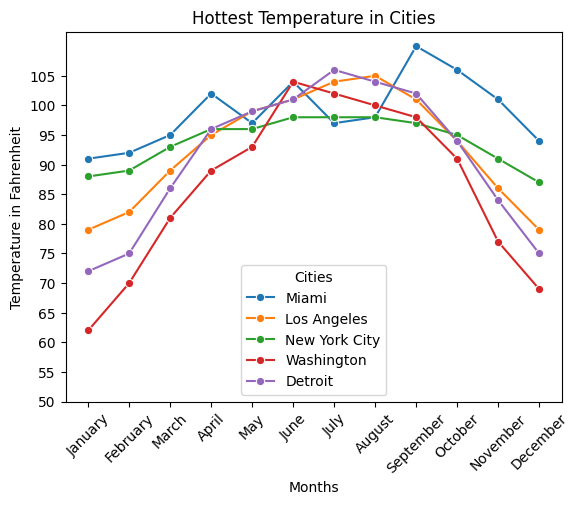

# HW 4 - CS 625, Spring 2025

Bhargav Iyer  
Due: March 15, 2025

## Dataset 3

I have chosen to work with Dataset 3.  This dataset is called the Hottest Temperature of Record--Selected Cities.  This dataset gives information regarding the highest observed temperature for each month, within several different cities across the United States.  I chose this dataset, because of the recent California wild fires and the sub-zero weather in other parts of the United States.  I thought it would be interesting to look more into the data and discover some more patterns.

## Question 1
- Choose 5 cities and compare their record highs in each month. You may pick the 5 cities however you wish, but you must discuss how you chose the cities.\

- I picked the following 5 cities (Miami, Los Angeles, New York City, Washington D.C., and Detroit).  This is because I wanted to look at different cities across the United States in order to better understand the hottest temperatures.  I especially wanted to look at Los Angeles (due to the wildfires) and New York City (for its typical cold weather).
- https://colab.research.google.com/drive/18pxS4CqzPteqrwEgz-FNgxVS4rrcn-w7#scrollTo=g7vqpM4xM-7f

Idiom: Multiline Chart
| Data: Attribute | Data: Attribute Type  | Encode: Channel | 
| --- |---| --- |
| Months | ordered, categorical | outer horizontal spatial region (x-axis) |
| Temperature | value, quantitative | vertical position on a common scale (y-axis) |
| Station | categorical | color hue |

The idiom is appropriate for this visualization, because of how it deals with temporal data, but also allows a good comparison between each city for the hottest temperature for each month.  This visualization also uses hue in order to distinguish between each city.  The data seems to show Miami and New York having consistent highest temperatures where Miami has a lot more hotter temperatures then the rest of the cities.  It also shows Los Angeles, Washington DC, and Detroit having a huge increase in hottest temperatures in June, July, August time period.  I wanted to use a line chart to convey comparisons for each month.  I also wanted to use hue in order to distinguish each city and make it easier to compare with other cities.

## Question 2
- Using the data from all of the cities, which month most often has the highest high? (Hint: For each month, show the number of times it had the highest high for a city.) \

- https://colab.research.google.com/drive/18pxS4CqzPteqrwEgz-FNgxVS4rrcn-w7#scrollTo=g7vqpM4xM-7f

Idiom: Histogram Chart
| Data: Attribute | Data: Attribute Type  | Encode: Channel | 
| --- |---| --- |
| Months | ordered, categorical | outer horizontal spatial region (x-axis) |
| Count | value, quantitative | vertical position on a common scale (y-axis) |

This idiom is appropriate for this visualization, because of how it deals with different categories (months) that makes it useful to do a count to find which months hold the hottest temperatures for these different cities.  The histogram is the most appropriate medium to show this data, because I am trying to show a count of some value of data.  This data seems to show that July having the highest counts of the highest temperature.  With June and August being 2nd and 3rd.  Finally at the end it is September and October.  All the other months do not have a count of highest temperature.  This shows that summer months typically have the highest temperature with July having a large lead in counts and the other months closest to it also having the hottest temperatures for every city in US.  It also shows other months not having the highest temperatures ever showing the seasonal process of Winter, Spring, and some months in Fall not having the hottest temperatures.

## Further Questions

Some further questions I have for this dataset would be trying to determine what could be:
- Do a geographic heat map of the U.S. with the hotter the temperature the redder the color for each month.  This data would need more cities and towns to get an accurate grasp on hottest temperatures.  Also, I would assume the cities and locations nearer the equator would be generally hotter.
- Through time is the hottest temperature increasing.  The data needed for this would be for more information regarding temperature throughout years.  Due to climate change, I am willing to assume that the temperature has been increasing through the years.  Also if there is information on the hottest temperature years in the current data, it might also give a hint on whether this hypothesis is true.

## References
- https://www.census.gov/library/publications/2009/compendia/statab/129ed/geography-environment.html
- https://colab.research.google.com/drive/18pxS4CqzPteqrwEgz-FNgxVS4rrcn-w7#scrollTo=g7vqpM4xM-7f
